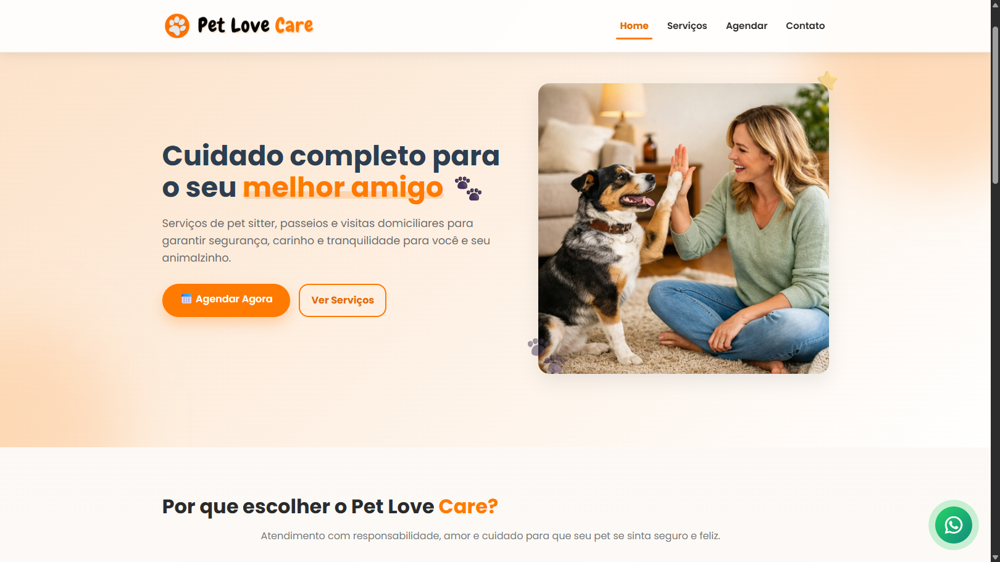
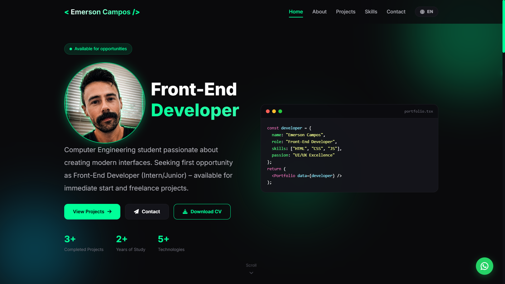
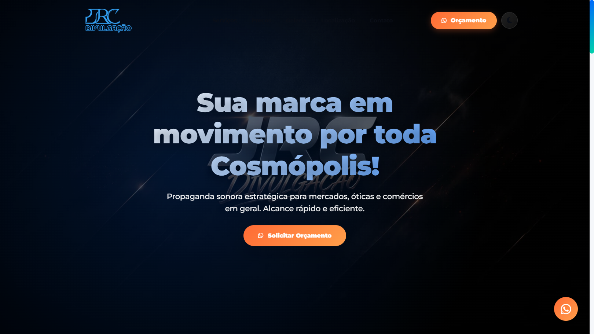
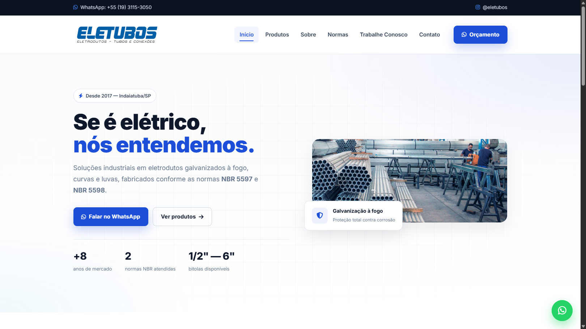

<!-- HEADER BANNER -->

  

<h3 align="center">💻 Desenvolvedor Front-End em formação | Engenharia da Computação</h3>

  Construindo projetos reais, aprendendo continuamente e evoluindo como desenvolvedor.

  

---

## 🚀 Sobre mim

Olá! 👋 Sou **Emerson Campos**, estudante de **Engenharia da Computação na Univesp** (2023 - atualmente).

💡 Atualmente foco no desenvolvimento **Front-End**, aplicando conhecimentos em projetos práticos com **HTML, CSS e JavaScript**.  

🎯 Tenho como objetivo evoluir para **Full Stack**, construindo uma base sólida em lógica, estrutura de código e boas práticas de engenharia de software.

---

## 🧠 Stack atual

### Front-end

### Ferramentas

---

## 📂 Projetos em destaque

<table align="center">
  <tr>
    <td align="center" width="50%">
      <h3>🐾 Pet Love Care</h3>
      
      
Plataforma de agendamento para pet sitter com foco em usabilidade e responsividade.

      
🔗 <a href="https://github.com/Emerson-O-Campos/pet-love-care">Repositório</a> • <a href="https://emerson-o-campos.github.io/pet-love-care/">Demo</a>

    </td>
    <td align="center" width="50%">
      <h3>🚀 Portfólio Pessoal</h3>
      
      
Portfólio moderno com design inspirado em neon e minimalismo.

      
🔗 <a href="https://github.com/Emerson-O-Campos/portifolio">Repositório</a> • <a href="https://emerson-o-campos.github.io/portifolio/">Demo</a>

    </td>
  </tr>
  <tr>
    <td align="center" width="50%">
      <h3>📢 JRC Divulgação</h3>
      
      
Site para serviços de divulgação de som, fortalecendo presença online.

      
🔗 <a href="https://github.com/Emerson-O-Campos/jrc-divulgacao">Repositório</a> • <a href="https://emerson-o-campos.github.io/jrc-divulgacao/">Demo</a>

    </td>
    <td align="center" width="50%">
      <h3>⚡ Eletubos</h3>
      
      
Redesign do site institucional com foco em modernização visual.

      
🔗 <a href="https://github.com/Emerson-O-Campos/eletubos">Repositório</a> • <a href="https://emerson-o-campos.github.io/eletubos/">Demo</a>

    </td>
  </tr>
</table>

---

## 📊 Estatísticas do GitHub

  

---

## 🎯 Foco atual

  
| Desenvolvimento Front-End | Lógica de programação | Projetos reais |
|:------------------------:|:----------------------:|:--------------:|
| ✅ HTML/CSS/JS | ✅ Algoritmos | ✅ 4+ projetos |
| 🔜 React | 🔜 Estruturas de dados | 🔜 Novos desafios |

---

## 🌍 Idiomas

- 🇧🇷 **Português** — Nativo
- 🇺🇸 **Inglês** — Intermediário (em desenvolvimento contínuo)  
  📘 *Leitura técnica, documentações e ampliando vocabulário para oportunidades globais*

---

## ⚡ Filosofia de desenvolvimento

> *"Aquele que tem um porquê para viver, pode suportar quase qualquer como."* — **Friedrich Nietzsche**

---

## 📫 Vamos conversar?

  
  
  
  

  📍 Indaiatuba - SP 
  💬 Aberto a oportunidades, colaboração e networking

---

## 📌 Últimas atualizações

- 🐾 **Pet Love Care** — Página de contato reformulada com cards e ícones (Maio/2026)
- 🚀 **Portfólio** — Design atualizado com cursor neon e novas animações
- 📢 **JRC Divulgação** — Melhorias de responsividade

---

  

